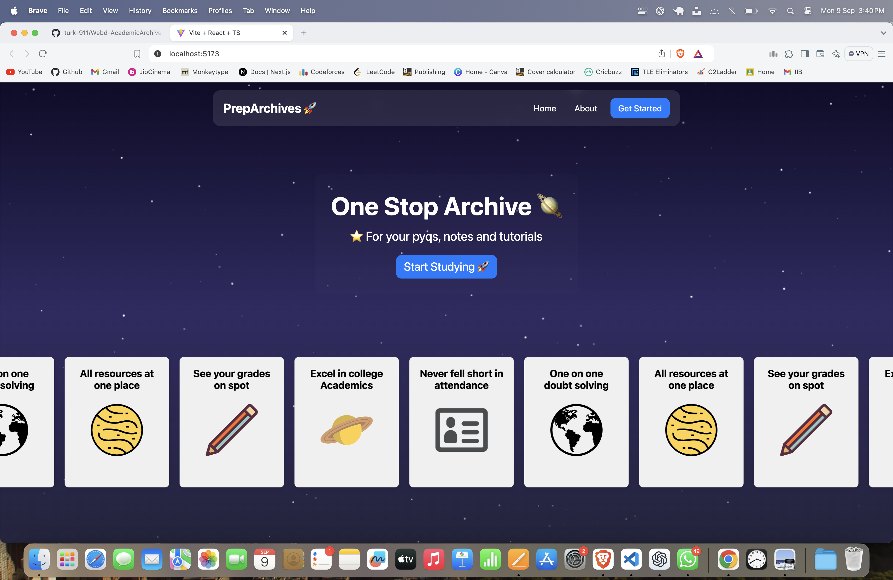
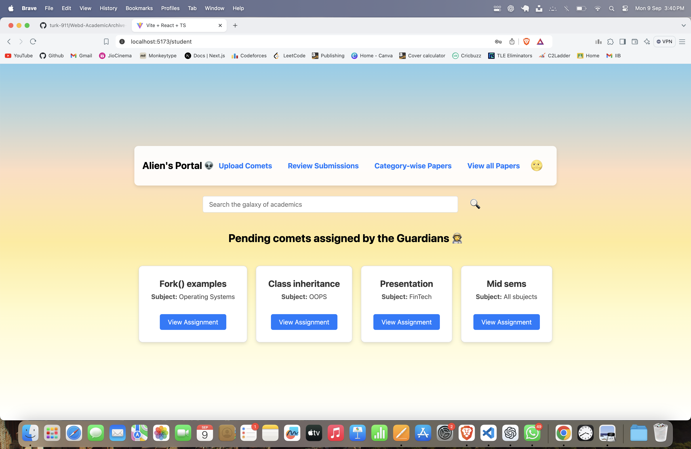
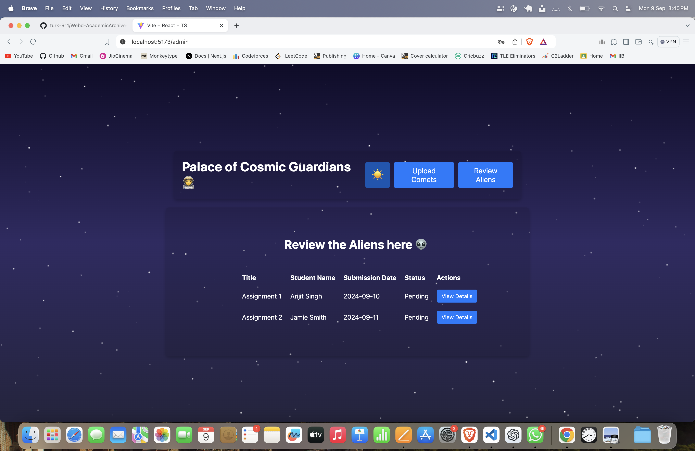

# PrepArchive

It is a React based project which is about centralization of resources of previous year question papers, notes, tutorials. It also contains assignment verification of aliens(students) by the cosmic guardians(teachers).

It allows the guardians to upload assignments, review submissions of the aliens / peasants, and give them marks. Obviously no government works without thinking of the peasants, thus we have a roll of subsidiaries for the peasants as well.

It helps peasants to look at their grades and work harder, allows them to see if the guardians have starred their assignment or not, help them choosing category wise papers and notes, and also view all papers at once.

For the night owls, it contains a starry background, and for the early risers, it contains a sunrise inspired bluish-pink sky.

## Table of Contents

- [Features](#features)
- [Screenshots](#screenshots)
- [Installation](#installation)
- [Usage](#usage)
- [Technologies](#technologies)

## Features

For the peasants / aliens:

- **Theme Toggle**: Easily switch between light and dark modes.
- **Assignment Upload**: Students can upload assignments with title, subject, and file.
- **Review Submissions**: Allows reviewing of assignments.
- **Category-Wise Paper Sorting**: Access papers sorted by categories.
- **View All Papers**: View all available papers.
- **Responsive Design**: Works across devices of all screen sizes.

For the cosmic guardians:

* **Assigning a new comet(Assignment):** Admins can upload new assignments.
* **Check the peasantry:** They can check the uploaded assignments and assign the stars.

## Screenshots

**Dark Mode (Space Theme):**



**Student Portal (Daylight Theme):**



**Admin Portal(Space theme):**



## Installation

1. **Clone the repository**:

   ```bash
   git clone https://github.com/turk-911/Webd-AcademicArchive-FrontEnd.git
   ```
2. **Navigate to the project directory**:

   ```bash
   cd Webd-AcademicArchive-FrontEnd
   ```
3. **Install dependencies**:

   ```bash
   npm install
   ```
4. **Run the development server**:

   ```bash
   npm run dev
   ```
5. **Visit the app** at `http://localhost:5173` in your browser.

## Usage

- **Theme Toggle**: Click on the theme toggle button (🌞/🌝) in the header to switch between dark and light modes.
- **Upload Assignments**: Navigate to the "Upload Comets" section and upload assignments by entering the title, subject, and file.
- **Review Submissions**: Use the "Review Submissions" section to review students' submitted assignments.
- **Search Papers**: Search for assignments and papers using the search bar at the top of the page.


## Technologies

It has been constructed with the use of React.js, Typescript, Vite and react router dom.
